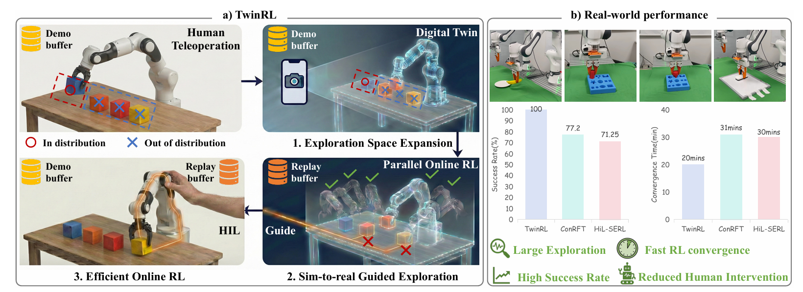

<div align="center">

# TwinRL-VLA: Digital Twin-Driven Reinforcement Learning for Real-World Robotic Manipulation

[](https://arxiv.org/abs/2602.09023)
[](https://sites.google.com/view/twinrl/twinrl)

<p>
  <a href="https://github.com/zhourui9813/Twin-RL">Qinwen Xu</a><sup>1,*</sup>&nbsp;&nbsp;
  <a href="https://liujiaming1996.github.io/">Jiaming Liu</a><sup>1,*,†</sup>&nbsp;&nbsp;
  <a href="https://zhourui9813.github.io/">Rui Zhou</a><sup>4,*</sup>&nbsp;&nbsp;
  <a href="https://github.com/Daniel-Shii">Shaojun Shi</a><sup>1,*</sup>&nbsp;&nbsp;
  <a href="https://github.com/HNW-HAN">Nuowei Han</a><sup>1,*</sup>&nbsp;&nbsp;
  <a href="https://zhuoyang-liu.github.io/">Zhuoyang Liu</a><sup>1</sup>&nbsp;&nbsp;
  <a href="http://guchenyang.site/">Chenyang Gu</a><sup>1</sup>&nbsp;&nbsp;
  <a href="https://openreview.net/profile?id=%7EShuo_Gu3">Shuo Gu</a><sup>2</sup>&nbsp;&nbsp;
  <a href="https://scholar.google.com/citations?hl=zh-TW&user=tE1oVQ4AAAAJ">Yang Yue</a><sup>3</sup>&nbsp;&nbsp;
  <a href="https://gaohuang-net.github.io/">Gao Huang</a><sup>3</sup>&nbsp;&nbsp;
  <a href="https://wzzheng.net/">Wenzhao Zheng</a><sup>3</sup>&nbsp;&nbsp;
  <a href="https://siruihan.com/">Sirui Han</a><sup>4</sup>&nbsp;&nbsp;
  <a href="https://scholar.google.com/citations?user=Z_QY_VwAAAAJ&hl=en">Peng Jia</a><sup>2</sup>&nbsp;&nbsp;
  <a href="https://www.shanghangzhang.com/">Shanghang Zhang</a><sup>1,📧</sup>
</p>

<p>
  <sup>1</sup>Peking University&nbsp;&nbsp;
  <sup>2</sup>Simplexity Robotics&nbsp;&nbsp;
  <sup>3</sup>Tsinghua University&nbsp;&nbsp;
  <sup>4</sup>Hong Kong University of Science and Technology
</p>

<sub><sup>*</sup>Equal Contribution&nbsp;&nbsp;<sup>†</sup>Project Lead&nbsp;&nbsp;<sup>📧</sup>Corresponding Author</sub>

</div>

---

Twin-RL is a digital twin-real-world collaborative RL framework designed to scale and guide exploration for VLA models.



## 📋 Table of Contents

- [Repository Structure](#-repository-structure)
- [Environment Setup](#-environment-setup)
- [Offline Training](#-offline-training)
- [Acknowledgments](#-acknowledgments)
- [Citation](#-citation)


## 🗓 TODO

- [x] Release digital twin assets & twin-generated datasets
- [x] Release offline training code
- [ ] Release real-world RL training code (coming soon)

## 📁 Repository Structure

```
Twin-RL/
├── examples/
│   ├── train_offline.py                # Entry point for offline training
│   └── experiments/*/config.py         # Task configurations
├── scripts/
│   ├── dataset_process_scripts/        # Data conversion & preprocessing
│   └── visualization_scripts/          # Trajectory & camera video visualization
├── octo/                               # Foundational VLA architecture
├── third_party/
│   ├── agentlace/                      # Data & network communication
│   └── dlimp/                          # Dataloading & processing utilities
└── docs/
    ├── TwinRL_Scripts_Usage_Guide.md   # Scripts usage guide
    └── Offline_Training_Guide.md       # Offline training walkthrough
```

> 📚 **Documentation & Guides:**
>
> - **[Scripts Usage Guide](./docs/TwinRL_Scripts_Usage_Guide.md)** — Data processing and visualization examples for all scripts in `scripts/`.
> - **[Offline Training Guide](./docs/Offline_Training_Guide.md)** — Complete walkthrough for the offline training phase.
> - **[Digital Twin Assets & Dataset](./docs/Twin_Assets_Dataset_Guide.md)** — Twin assets, demonstration trajectories, and download instructions.

## 📦 Digital Twin Assets & Dataset

We release the high-fidelity digital twin assets and twin-generated trajectories used in this project, covering four manipulation tasks: **Pick-and-Place**, **Insert-Hexagon-Block**, **Insert-Triple-Column-Block**, and **Erase-Whiteboard**.

👉 **[Download from Google Drive](https://drive.google.com/drive/folders/1f58K3IYd3RjkA-oTWW17bSZk4EM06JCV?usp=sharing)**

For detailed contents and task descriptions, see the **[Digital Twin Assets & Dataset Guide](./docs/Twin_Assets_Dataset_Guide.md)**.

## 🛠 Environment Setup

### 1. Clone & Create Conda Environment

```bash
git clone https://github.com/zhourui9813/Twin-RL.git
cd Twin-RL

conda create -n twin-rl python=3.10
conda activate twin-rl
```

### 2. Install Dependencies

```bash
pip install -r requirements.txt
```

<details>
<summary>⚠️ <b>Note: On-Demand JAX Installation</b></summary>
<br>

Because CUDA versions vary across machines, `jax` is intentionally omitted from `requirements.txt`. Install it manually based on your CUDA environment:

```bash
# Example: CUDA 11
pip install --upgrade "jax[cuda11_pip]==0.4.20" \
  -f https://storage.googleapis.com/jax-releases/jax_cuda_releases.html
```

Replace `cuda11_pip` with the version that matches your CUDA setup.

</details>

### 3. Install Octo

```bash
cd octo && pip install -e . && cd ..
```

### 4. Install Third-Party Dependencies

```bash
cd third_party/agentlace && pip install -e .
cd ../dlimp && pip install -e .
cd ../..
```

## 🚀 Offline Training

Before conducting online real-world RL, the model requires an offline training phase using digital twin data.

We have prepared a comprehensive guide covering everything from downloading pre-trained weights and dataset preprocessing to launching your training experiments.

👉 **[Offline Training Guide](./docs/Offline_Training_Guide.md)**

## 🙏 Acknowledgments

We thank the authors of [Octo](https://github.com/octo-models/octo), [HIL-SERL](https://github.com/rail-berkeley/hil-serl), [ConRFT](https://github.com/cccedric/conrft), [Agentlace](https://github.com/youbvr/agentlace), [Dlimp](https://github.com/kvablack/dlimp) for sharing their codebase, which provided a solid foundation for our work.


## 📄 Citation

If you find our work helpful, please consider citing our paper:

```bibtex
@article{xu2026twinrl,
  title={TwinRL-VLA: Digital Twin-Driven Reinforcement Learning for Real-World Robotic Manipulation},
  author={Xu, Qinwen and Liu, Jiaming and Zhou, Rui and Shi, Shaojun and Han, Nuowei and Liu, Zhuoyang and Gu, Chenyang and Gu, Shuo and Yue, Yang and Huang, Gao and others},
  journal={arXiv preprint arXiv:2602.09023},
  year={2026}
}
```