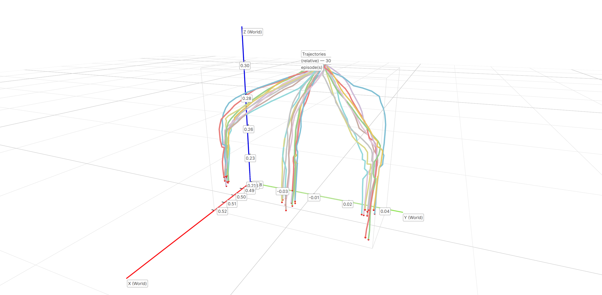

# Twin-RL Offline Training Guide

This guide details the complete workflow for offline training in the Twin-RL framework, from data preparation to launching the training script.

> Before moving to real-world RL, you must first complete this offline training phase to get a well-initialized model.

---

## Table of Contents

- [1. Prerequisites for Offline Training](#1-prerequisites-for-offline-training)
  - [1.1 Download Octo Pre-trained Weights](#11-download-octo-pre-trained-weights)
  - [1.2 Convert Raw Twin Data to Training Set](#12-convert-raw-twin-data-to-training-set)
  - [1.3 Offline Training Data Preprocessing](#13-offline-training-data-preprocessing)
  - [1.4 Data Visualization Check (Optional)](#14-data-visualization-check-optional)
- [2. Offline Training Pipeline](#2-offline-training-pipeline)
  - [2.1 Configuration & Task Registration](#21-configuration--task-registration)
  - [2.2 Launch Training Script](#22-launch-training-script)

---

## 1. Prerequisites for Offline Training

Follow the steps below to prepare your pre-trained weights and training datasets.

### 1.1 Download Octo Pre-trained Weights

Download the `octo-small` pre-trained weights from HuggingFace to your local directory:

```bash
mkdir model_hub && cd model_hub
huggingface-cli download rail-berkeley/octo-small --local-dir model_hub
cd ..
```

### 1.2 Convert Raw Twin Data to Training Set

Modify the input/output paths and parameters in `scripts/dataset_process_scripts/run_data_format_conversion.sh`, then execute:

```bash
cd scripts/dataset_process_scripts
bash run_data_format_conversion.sh
```

> **💡 Tips:**
>
> - For detailed parameter instructions, refer to the [Scripts Usage Guide](./TwinRL_Scripts_Usage_Guide.md).
> - For tasks that **do not involve learning gripper open/close actions**, append the `--fix-gripper` flag (and set `--fix-gripper-state` as needed).

### 1.3 Offline Training Data Preprocessing

Use the one-click preprocessing script `offline_train_dataset_preprocess.sh`, which sequentially executes the following pipeline:

| Step | Script | Description |
|---|---|---|
| 1 | `convert_absolute_to_delta.py` | Absolute actions → Delta actions |
| 2 | `normalize_actions.py` | Action normalization (optional, skippable via `--no_normalize`) |
| 3 | `state_process.py` | State preprocessing |

```bash
cd scripts/dataset_process_scripts

# Execute full pipeline (including normalization)
bash offline_train_dataset_preprocess.sh /path/to/dataset.pkl

# Execute pipeline but skip normalization
bash offline_train_dataset_preprocess.sh /path/to/dataset.pkl --no_normalize
```

### 1.4 Data Visualization Check (Optional)

<details>
<summary><b>Trajectory Visualization</b></summary>
<br>

```bash
python scripts/visualization_scripts/trajectory_visualization.py \
  /path/to/data.pkl \
  --output /path/to/traj.png \
  --stat_path /path/to/action_stats.json \
  --is_normalized \
  --pose_type relative \
  --reset_pose "0.48,0.0,0.30,3.14,0.0,0.0" \
  --vis_port 8080
```

> **💡 Note:** This will start a local server and output a link in the terminal. Access it via your web browser to view the interactive [Viser 3D visualization interface](https://viser.studio/main/).
>
> 

</details>

<details>
<summary><b>Camera Video Visualization</b></summary>
<br>

```bash
python scripts/visualization_scripts/visualize_camera_video.py \
  --input_file /path/to/data.pkl \
  --output_dir /path/to/output_videos \
  --concat_all \
  --fps 10
```

</details>

For detailed usage of all visualization scripts, refer to the [Scripts Usage Guide](./TwinRL_Scripts_Usage_Guide.md).

---

## 2. Offline Training Pipeline

### 2.1 Configuration & Task Registration

**Step 1 — Create a New Task Config**

Define `TrainConfig` and `EnvConfig` in `examples/experiments/<new_task>/config.py`:

| Field | Description |
|---|---|
| `task_desc` | Language description of the corresponding task |
| `octo_path` | Local path to the downloaded Octo pre-trained weights (e.g., `model_hub/`) |

**Step 2 — Register the Task Mapping**

Open `examples/experiments/mappings.py` and add your new task name and config to the `CONFIG_MAPPING` dictionary. Otherwise, the `--exp_name` argument will not be recognized during training.

### 2.2 Launch Training Script

Open the execution script in your target task directory (e.g., `run_offline_pretrain.sh`) and modify the following variables:

| Variable | Description |
|---|---|
| `EXP_NAME` | Current task name (must match the key registered in `mappings.py`) |
| `DEMO_PATH` | Path to the final preprocessed training `.pkl` dataset |
| `CKPT_ROOT` | Root directory for saving checkpoints |

Once modified, run the script from the project root:

```bash
bash examples/experiments/task1_pick_banana_basket/run_offline_pretrain.sh
```