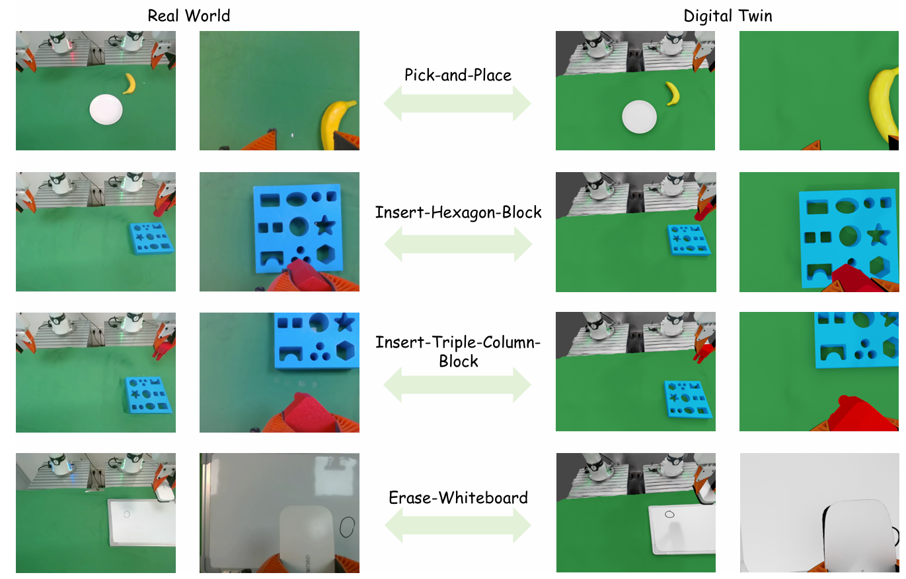

# Digital Twin Assets & Twin Dataset

**High-fidelity digital twin assets and twin-generated trajectories for the TwinRL project.**

------

## Overview

This repository provides the digital twin assets and demonstration datasets used in the [TwinRL](https://github.com/zhourui9813/Twin-RL) project.

| Category    | Contents                                                     |
| ----------- | ------------------------------------------------------------ |
| **Assets**  | Mesh-based digital twin assets (objects / scene / robot)     |
| **Dataset** | Twin-generated demonstrations & trajectories (SFT warm-up + twin buffer) |

## Download

All assets and datasets are hosted on Google Drive:

👉 **[Google Drive](https://drive.google.com/drive/folders/1f58K3IYd3RjkA-oTWW17bSZk4EM06JCV?usp=sharing)**

## Tasks

The dataset currently covers four manipulation tasks:

| Task                           | Description                                              |
| ------------------------------ | -------------------------------------------------------- |
| **Pick-and-Place**             | Pick up an object and place it into a target location    |
| **Insert-Hexagon-Block**       | Insert a hexagon-shaped block into the matching slot     |
| **Insert-Triple-Column-Block** | Insert a triple-column block into the corresponding slot |
| **Erase-Whiteboard**           | Grasp an eraser and wipe the whiteboard surface          |